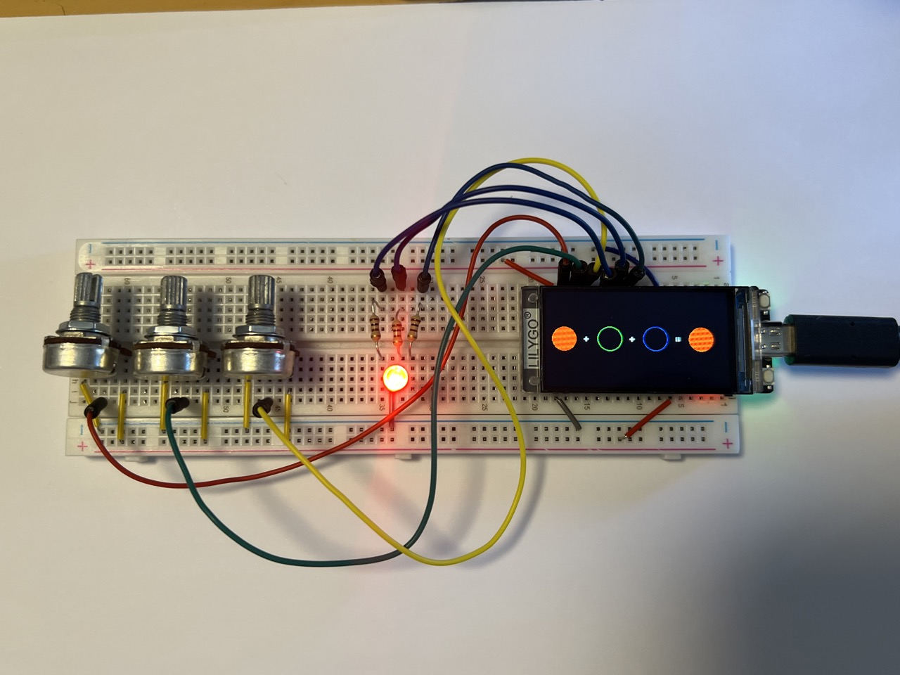
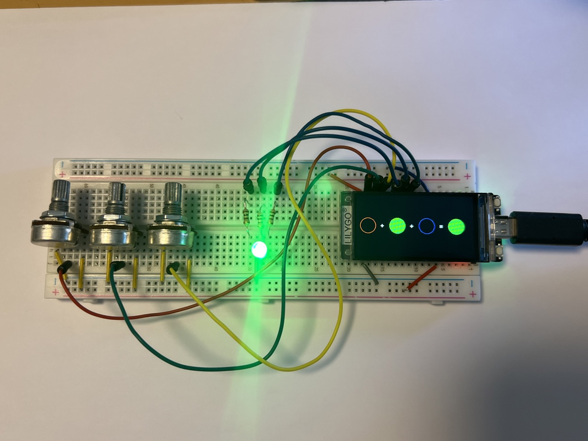
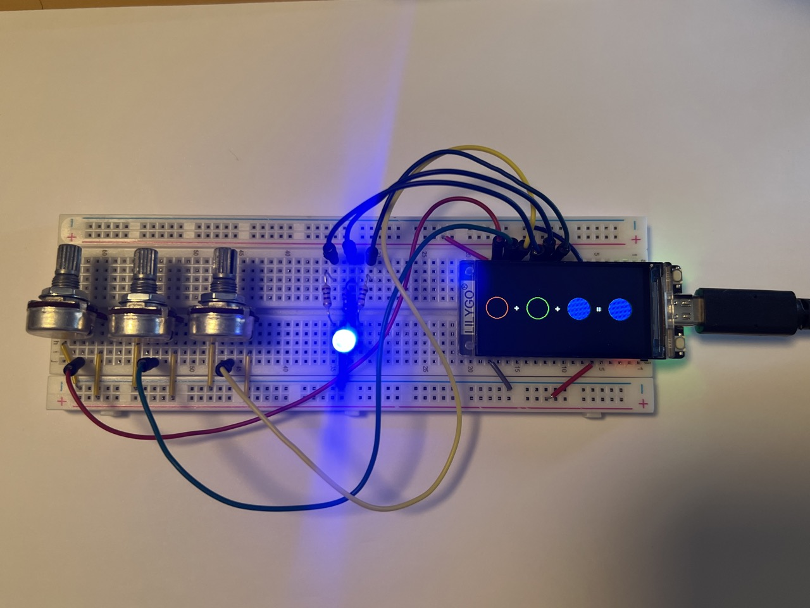
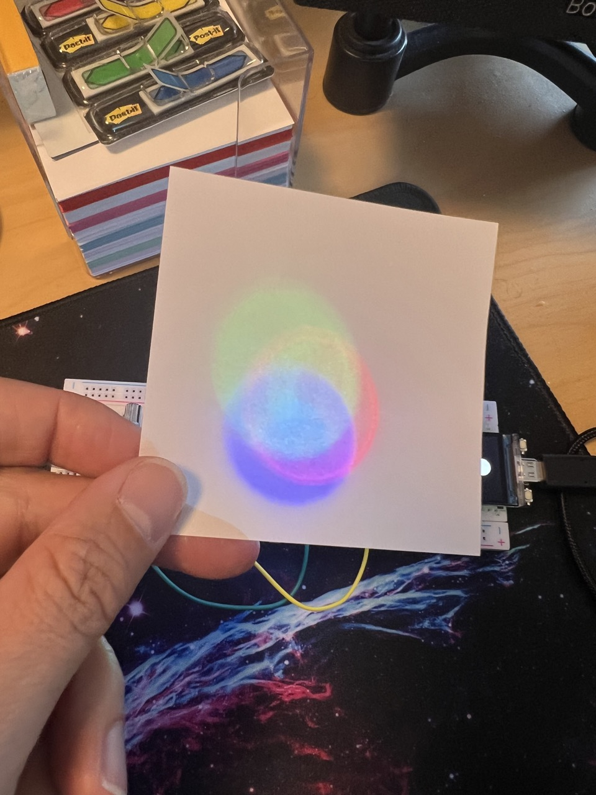

# Color mixer using the Lilly T-Display-S3

This project uses a [LilyGo T-Display-S3](https://github.com/Xinyuan-LilyGO/T-Display-S3) to mix three colours (red, green, blue) showing the resulting colour. Both the input colours and the resulting colour are showned both on the TFT display as well as on an RGB LED.

The following materials are necessary:

* 3x Linear potenciomer (1K)
* 3x Resistors (100 Ohm)
* 1x RGB LED, Common cathod
* 1x LilyGo T-Display-S3 with TFT

This project uses the following connections:

* Pin 1 - Input - RED channel (analog input)
* Pin 2 - Input - GREEN channel (analog input)
* Pin 3 - Input - BLUE channel (analog input)
* Pin 11 - Output - RED channel (PWM output)
* Pin 12 - Output - GREEN channel (PWM output)
* Pin 13 - Output - BLUE channel (PWM output)

## Images of the project and video

There are some images of the project:

|   |   |
|---|---|
|   |   |

## How to compile and run

Make sure you do the proper connections as described in the section above. 

Requirements:

* Make sure that you have [Visual Studio Code](https://code.visualstudio.com) installed
* Make sure that you have [Platform IO](https://platformio.org) installed
* Make sure you have [Espressif IDF](https://github.com/espressif/vscode-esp-idf-extension) extension installed

If you have all these installed, simply open the project in PlatformIO, hit the "build" and "upload" buttons.
